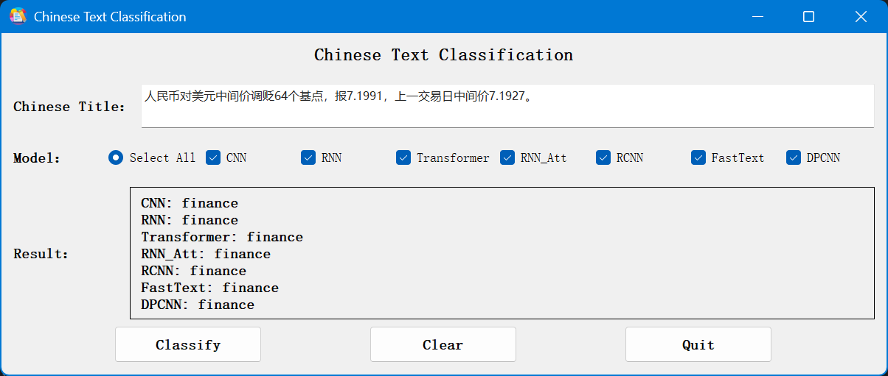

# ChineseTextClassificationGUI
程序参考GitHub开源项目：https://github.com/649453932/Chinese-Text-Classification-Pytorch

我利用原作者的项目训练好模型，将模型预测结果使用GUI进行输出。
GUI页面采用PyQt5进行编写，因此需要有PyQt5的库文件，并且需要安装tensorboardX,numpy等库。
推荐使用PyCharm打开项目，运行main.py即可。
注意：需要自行在saved_dict目录下放置各个模型的.ckpt文件，软件才可以正常运行。

<h3>程序运行图</h3>
主页面如下图所示：
 

分类结果如下图所示：
 

