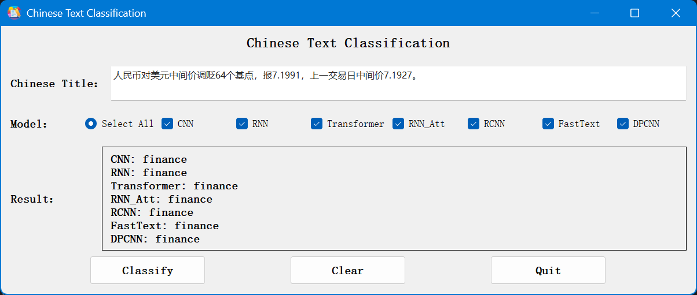
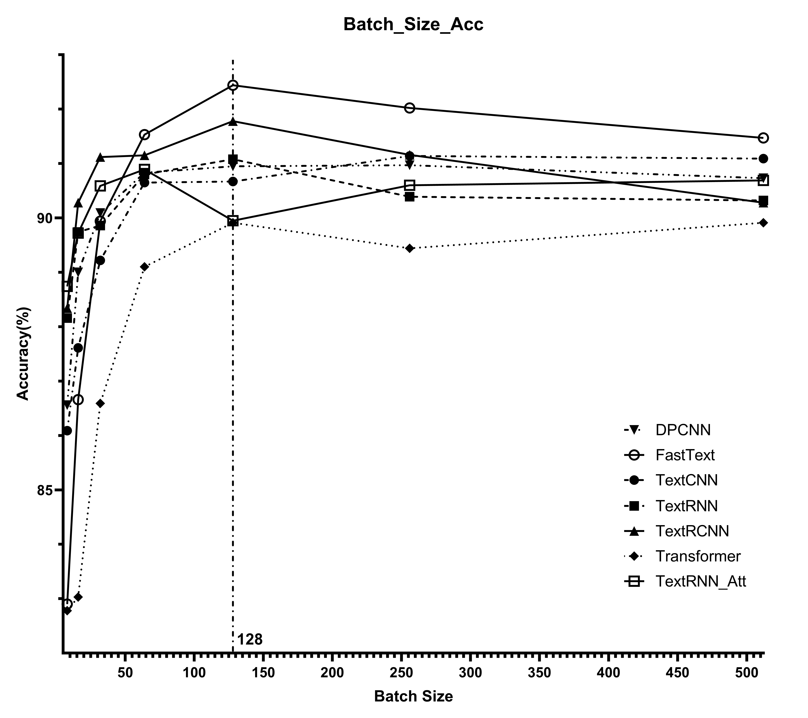
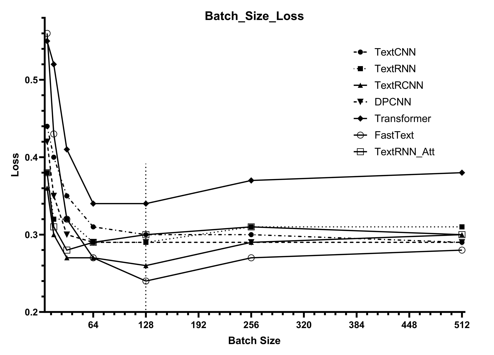
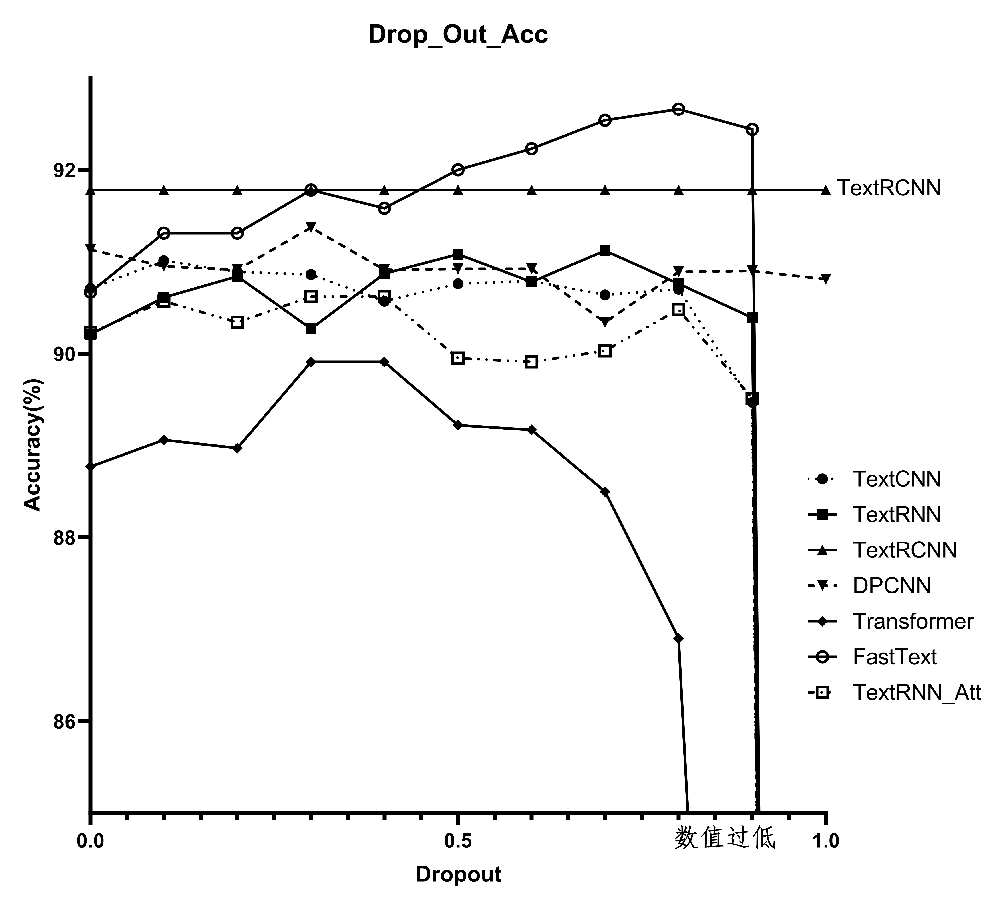
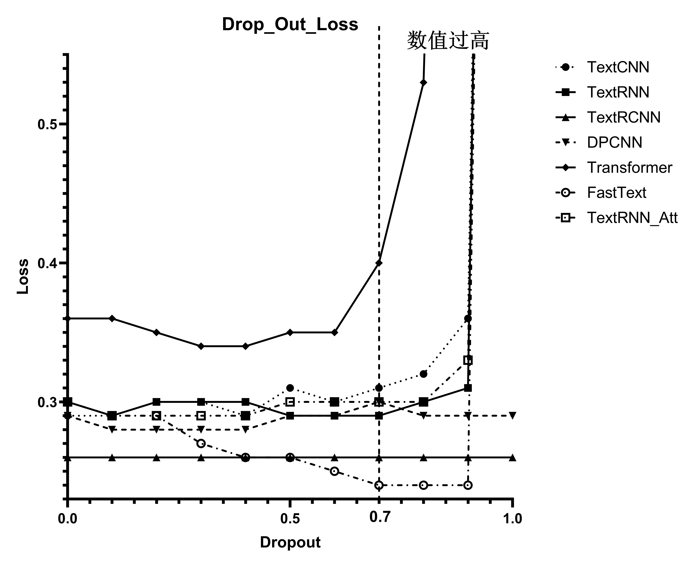
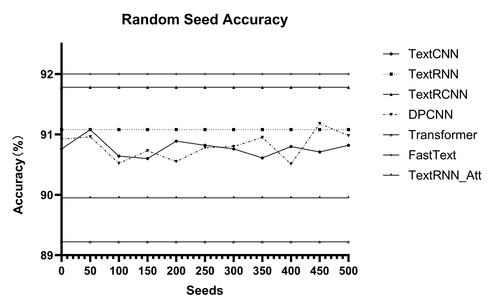
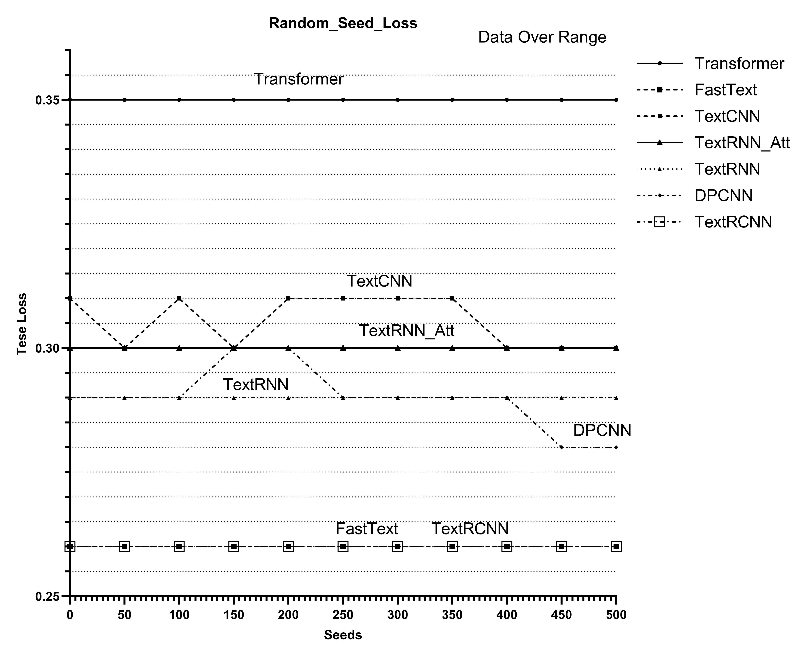

# ChineseTextClassificationGUI

## 介绍

程序参考GitHub开源项目：
<a href="https://github.com/649453932/Chinese-Text-Classification-Pytorch" title="原作者链接" target="_blank">原作者链接</a>

模型分析及GUI实现原理：
<a href="https://zhuanlan.zhihu.com/p/9187712386" title="原理在这里" target="_blank">我的个人博客</a>

使用原作者的项目训练好模型，将模型预测结果使用GUI进行输出。模型预测准确度相对较高。GUI页面采用PyQt5进行编写，因此需要有PyQt5的库文件，并且需要安装sklearn,numpy等库。
推荐使用PyCharm打开项目，运行main.py即可。如果使用PyCharm，需要自行配置虚拟环境，具体环境需求，在下方有介绍，请参考。
推荐使用安装CUDA的Nvidia计算卡设备进行模型训练。使用CPU运算，其运算时间相对较长，FastText模型可能需要40-60min进行训练。
如果使用CUDA，需要自行配置环境变量以及安装对应版本PyTorch。MacOS或Linux参考PyTorch官网介绍。下方环境配置均有介绍。
</br>

**注意：需要自行在saved_dict目录下放置各个模型的.ckpt文件，软件才可以正常运行。**

## 程序运行图

### 主页面如下图所示：
</br>

    
### 分类结果如下图所示：
</br>


## 模型性能


### Batch-Size

#### Batch-Size Accuracy



#### Batch-Size Loss



***

### Drop Out

#### Drop-Out Accuracy


    
#### Drop-Out Loss



***

### Random Seed

#### Random-Seed Accuracy


    
#### Random-Seed Loss



***

#### 项目中所使用的参数已是作者所测试的最佳值，模型表现为我所测试的最佳状态。

***

<br>

## 训练及运行环境
python 3.8.7<br>
tensorboardX<br>
tdqm<br>
pytorch 1.1<br>
PyQt5(注意不是PyQt6或PySide6)<br>
sklearn<br>
numpy<br>

## 训练环境安装方法<br>

```
pip install tqdm
pip install pyqt5
pip install numpy
pip install tensorboardX
pip install scikit-learn
pip install torch
```

**注意⚠️torch版本应在PyTorch官网查看对应CUDA版本的合适版本，具体安装命令需根据官网进行安装，官网链接:**
<a href="https://pytorch.org" title="PyTorch官网">PyTorch官网链接</a>

## 模型训练方法<br>

小提示：

<ul>
    <li>如果是在PyCharm等IDE中，则直接打开IDE中对应的命令行窗口，按需训练模型即可</li>
    <li>如果是使用IDLE，则需要进入项目的目录中，Windows右键进入命令提示符进行训练，Linux直接在CLI中进行目录切换，直接训练即可</li>
</ul>

`python run.py —model TextCNN #训练TextCNN模型的方法`<br><br>
`python run.py —model TextRNN #训练TextCNN模型的方法`<br><br>
`python run.py —model TextRCNN #训练TextCNN模型的方法`<br><br>
`python run.py —model FastText #训练TextCNN模型的方法`<br><br>
`python run.py —model TextRNN_Att #训练TextCNN模型的方法`<br><br>
`python run.py —model DPCNN #训练TextCNN模型的方法`<br><br>
`python run.py —model Transformer #训练TextCNN模型的方法`<br>
<br>

## 使用说明
<ul>
<li>模型文件需要按上述步骤自行训练，也可直接导入自己预训练好的模型</li>
<li>运行需有PyQt5库，否则无法正常运行，需自行配置环境变量或使用虚拟环境</li>
<li>打开main.py，使用IDE或python命令即可运行，出现GUI界面</li>
<li>如果程序出现bug，请发issues，在看到后会及时改正</li>
</ul>

## 信息

### 上传日期：2024年11月25日 22:50

</br>

### 作者：Sam iLiant（参考源项目见上述链接）
